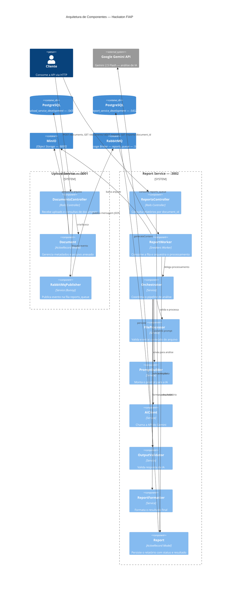
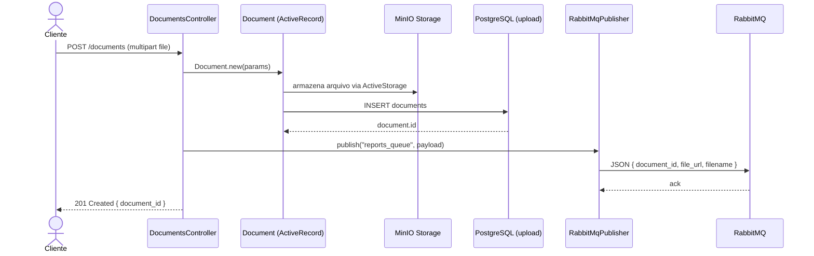
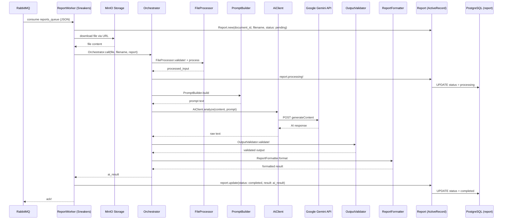
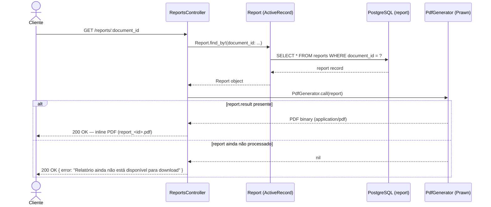

# Hackaton FIAP

Este repositório contém a solução desenvolvida para o Hackaton FIAP. A arquitetura é baseada em microsserviços em Ruby on Rails, utilizando mensageria para comunicação assíncrona e armazenamento de objetos.

## Arquitetura do Projeto

O ecossistema é composto por dois serviços independentes, além de uma infraestrutura compartilhada via Docker Compose:

*   **Upload Service (/upload_service):** Responsável por receber os arquivos enviados, gerenciar o armazenamento no MinIO e notificar o processamento via RabbitMQ.
*   **Report Service (/report_service):** Responsável por consumir as mensagens do Broker, processar os dados e gerar os relatórios correspondentes. Possui um Worker dedicado (report_worker) rodando de forma assíncrona com a gem Sneakers.

---

## Documentação dos Serviços

Cada microsserviço possui suas próprias particularidades, variáveis de ambiente, configurações de banco de dados e rotas. Para entender o funcionamento, setup local e testes de cada um deles, acesse os respectivos guias:

*   [Documentação do Upload Service](./upload_service/README.md)
*   [Documentação do Report Service](./report_service/README.md)

---

## Infraestrutura Global (Docker Compose)

A raiz do projeto gerencia toda a orquestração dos containers de desenvolvimento por meio do arquivo docker-compose.yml.

### Componentes Globais da Rede:
*   **Banco de Dados (PostgreSQL):** Dois bancos isolados rodando em portas distintas para garantir a autonomia dos dados de cada serviço (db-upload na porta 5431 e db-report na porta 5432).
*   **Message Broker (RabbitMQ):** Responsável pela fila de comunicação entre os serviços. Inclui o painel de gerenciamento na porta 15672.
*   **Object Storage (MinIO):** API compatível com S3 para armazenamento de arquivos e relatórios. Painel console disponível na porta 9001.

---

## Diagrama da Arquitetura

### Visão Geral dos Componentes



---

### Fluxo 1 — Upload de Documento



---

### Fluxo 2 — Processamento Assíncrono (Worker)



---

### Fluxo 3 — Consulta de Relatório



---

## Segurança

### Requisitos Básicos Adotados

A solução foi desenvolvida seguindo um conjunto mínimo de requisitos de segurança adequados ao contexto de um hackaton:

- **Segredos via variáveis de ambiente:** credenciais sensíveis (chave da API Gemini, credenciais do RabbitMQ, MinIO e PostgreSQL) nunca são hardcoded no código-fonte. Todas são injetadas via `ENV` e gerenciadas pelo Docker Compose ou por um arquivo `.env` não versionado.
- **Filtragem de parâmetros nos logs:** o `filter_parameter_logging.rb` de ambos os serviços mascara automaticamente campos sensíveis (`passw`, `token`, `secret`, `_key`, `salt`, `certificate`, entre outros) nos logs do Rails, evitando exposição acidental em saídas de produção.
- **URLs pré-assinadas com expiração:** os links do MinIO gerados para acesso aos arquivos têm validade de 15 minutos (`expires_in: 15.minutes`), limitando a janela de exposição de objetos armazenados.
- **CORS desabilitado por padrão:** as configurações de CORS em ambos os serviços estão comentadas, bloqueando requisições cross-origin até que origens explícitas sejam definidas.
- **Isolamento de rede via Docker:** todos os containers comunicam-se exclusivamente pela rede interna `microservices_network`, sem exposição desnecessária de portas internas ao host.
- **Banco de dados isolado por serviço:** cada microsserviço possui seu próprio banco PostgreSQL, sem compartilhamento de credenciais ou schema entre eles.

---

### Validação e Tratamento de Entradas Não Confiáveis

**Upload Service:**
- Parâmetros de requisição são filtrados via `params.permit(...)` (strong parameters do Rails), rejeitando qualquer campo não listado explicitamente.
- O arquivo enviado é manipulado exclusivamente pelo ActiveStorage, que abstrai o acesso direto ao sistema de arquivos e evita path traversal.

**Report Service — FileProcessor:**
- Todo arquivo recebido pelo worker é validado antes do processamento: verifica se o conteúdo não está vazio e restringe extensões aceitas à lista explícita `[.pdf, .png, .jpg, .jpeg]`.
- Arquivos com extensão não suportada lançam exceção controlada, encerrando o fluxo antes de qualquer operação sobre o conteúdo.
- A extração de texto de PDFs utiliza a gem `pdf-reader` sobre um `StringIO`, sem escrita em disco.

---

### Uso Controlado de Modelos de IA

O escopo da IA é restringido em duas camadas:

1. **System rules fixas no `AiClient`:** toda chamada ao Gemini inclui instruções de sistema imutáveis que delimitam o papel do modelo (`"Você é um especialista em arquitetura de software"`), proíbem invenção de informações (`"Não invente informações"`) e impõem formato de saída (`"Responda apenas com JSON válido"`). Essas regras são concatenadas ao prompt em tempo de execução e não são expostas ao usuário.

2. **Formato de resposta obrigatório via `PromptBuilder`:** o prompt instrui explicitamente o modelo a retornar um JSON com campos pré-definidos (`componentes`, `descricao_arquitetura`, `riscos`, `boas_praticas`, `recomendacoes`, `confianca`). Isso delimita o espaço de resposta e torna o comportamento do modelo previsível e verificável.

---

### Tratamento Seguro de Falhas da IA

- **`OutputValidator`:** valida estruturalmente a resposta do Gemini antes de qualquer uso. Se o JSON retornado não puder ser parseado (`JSON::ParserError`) ou estiver faltando campos obrigatórios (`REQUIRED_KEYS`), uma exceção é lançada imediatamente com mensagem descritiva, impedindo que dados malformados ou incompletos sejam persistidos.
- **`AiClient#extract_text`:** remove formatação Markdown residual (blocos ` ```json `) da resposta antes de repassá-la ao validador, prevenindo falsos negativos no parse de JSON.
- **`ReportWorker`:** erros do tipo `OpenURI::HTTPError` (falha no download do arquivo) e `StandardError` genérico são capturados em blocos `rescue` separados. Em ambos os casos o relatório é marcado como `failed!` e a mensagem é rejeitada na fila (`reject!`), evitando reprocessamento infinito de mensagens problemáticas.

---

### Segurança na Comunicação entre Serviços

| Canal | Mecanismo |
|---|---|
| Upload Service → RabbitMQ | Publicação autenticada via `RABBITMQ_URL` com usuário/senha; mensagens persistentes (`persistent: true`) e fila durável (`durable: true`) |
| RabbitMQ → Report Worker | Consumo autenticado via Sneakers/Bunny; worker processa uma mensagem por vez |
| Report Worker → MinIO | Download via URL pré-assinada com expiração de 15 minutos |
| Serviços → PostgreSQL | Conexão via `DATABASE_URL` com credenciais injetadas por variável de ambiente; sem acesso externo à porta do banco |
| Serviços → Gemini API | HTTPS obrigatório (endpoint `googleapis.com`); chave de API via `ENV['GEMINI_API_KEY']` |

---

### Principais Riscos e Limitações Conhecidas

| # | Risco | Impacto | Observação |
|---|---|---|---|
| 1 | **Ausência de autenticação nas APIs** | Alto | As rotas de upload e consulta não exigem nenhum token ou credencial. Qualquer cliente com acesso à rede pode enviar arquivos ou ler relatórios. |
| 2 | **Ausência de rate limiting** | Médio | Não há controle de volume de requisições, tornando os serviços suscetíveis a abuso ou esgotamento de cota da API Gemini. |
| 3 | **Chave Gemini sem escopo restrito** | Médio | A `GEMINI_API_KEY` é utilizada sem restrições de IP ou de método. Uma exposição acidental da chave permite uso irrestrito da conta. |
| 4 | **CORS totalmente desabilitado** | Baixo/Médio | Adequado para o ambiente atual, mas precisa ser configurado explicitamente com origens permitidas antes de qualquer exposição pública. |
| 5 | **Sem validação de tamanho de arquivo** | Médio | Não há limite de tamanho no upload, o que pode ser explorado para esgotamento de disco no MinIO ou memória no worker durante o processamento. |
| 6 | **Prompt injection via conteúdo do arquivo** | Médio | O texto extraído de PDFs é enviado diretamente ao modelo. Um arquivo malicioso poderia tentar manipular o comportamento da IA via instruções embutidas no conteúdo. As system rules atuais mitigam parcialmente, mas não eliminam esse risco. |
| 7 | **Comunicação interna sem TLS** | Baixo | A comunicação entre os containers (RabbitMQ, MinIO, PostgreSQL) ocorre sem criptografia em trânsito, o que é aceitável em rede Docker privada, mas deve ser endereçado em ambientes de produção. |
